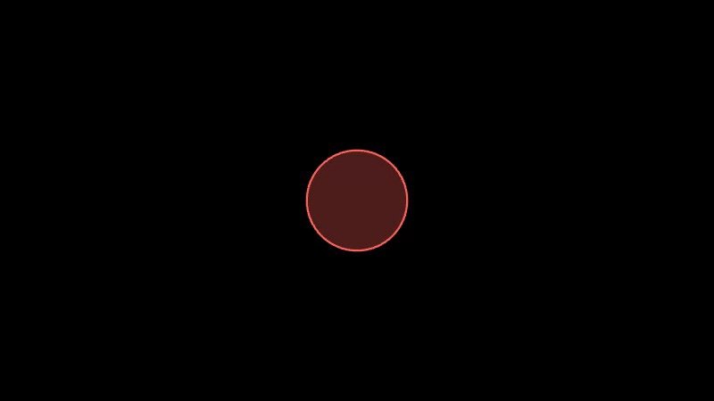

# myst-manim-extension

A [MyST](https://mystmd.org) plugin that lets you embed interactive
[manim-web](https://github.com/maloyan/manim-web) animations directly in your
documents.

You write only the animation logic. The `scene` object, all shapes, animations,
colors, and rate functions are already in scope — no imports, no boilerplate.

See some examples of animations and the code [here](https://dobbikov.github.io/myst-manim-plugin/).

## Installation

Copy **both** `plugin.mjs` and `widget.mjs` into your project and register the plugin in `myst.yml`:

```yaml
version: 1
project:
  title: My Project
  plugins:
    - manim.mjs
```

Then run:

```bash
myst start
```

No npm install needed — manim-web is loaded from a CDN at render time.


## Usage

Use the `manim` directive in any `.md` file:

````
:::{manim}
const circle = new Circle({ color: RED, fillOpacity: 0.3 });
scene.add(circle);
await scene.play(new Create(circle));
await scene.wait(1);
await scene.play(new FadeOut(circle));
:::
````


The body is plain JavaScript. Everything from manim-web is already destructured into scope, and your code runs inside an `async` function so you can `await` every animation call.

---

## Options

All options are optional.

| Option | Type | Default | Description |
|---|---|---|---|
| `width` | number | `800` | Canvas width in pixels |
| `height` | number | `450` | Canvas height in pixels |
| `background-color` | string | `#000000` | Background color as a CSS hex value |

```
:::{manim}
:width: 1000
:height: 500
:background-color: #1e1e2e

// your animation code
:::
```

---

## What's in scope

You don't need to import anything. The following are available directly:

### `scene`

The `Scene` instance, already attached to a canvas in the page.

```js
scene.add(mobject)           // add to scene
scene.remove(mobject)        // remove from scene
await scene.play(animation)  // play one or more animations in parallel
await scene.wait(seconds)    // pause
scene.clear()                // remove all mobjects
```

### Shapes

| Name | Description |
|---|---|
| `Circle` | Circle with configurable radius |
| `Square` | Square with configurable side length |
| `Rectangle` | Rectangle with width and height |
| `Triangle` | Triangle shape |
| `Polygon` | Arbitrary polygon from vertices |
| `RegularPolygon` | n-sided regular polygon |
| `Ellipse` | Ellipse |
| `Arc` | Arc segment |
| `Dot` | Small filled dot |
| `Line` | Line segment |
| `Arrow` | Line with arrowhead |

Common shape options:

```js
new Circle({
  radius: 1.5,
  color: RED,          // color constant or hex string '#ff0000'
  fillOpacity: 0.5,    // 0 = transparent fill, 1 = solid fill
  strokeWidth: 2,
})
```


### Text and math

| Name | Description |
|---|---|
| `Text` | Plain text |
| `MathTex` | LaTeX math expression, rendered via KaTeX |
| `Paragraph` | Multi-line text |
| `MarkupText` | Text with inline markup |

```js
new Text('Hello world', { fontSize: 48, color: WHITE })
new MathTex('E = mc^2')
new MathTex(['\\frac{1}{2}', '+', '\\frac{1}{3}'])  // multi-part for styling
```

### Groups

| Name | Description |
|---|---|
| `VGroup` | Group of vector mobjects, supports `.arrange()` |
| `Group` | Generic container |

```js
const group = new VGroup(circle, square, triangle);
group.arrange(undefined, 0.5);  // lay out with 0.5 unit spacing
```

### Coordinate systems

| Name | Description |
|---|---|
| `Axes` | 2D axes with tick marks and labels |
| `NumberLine` | 1D number line |
| `NumberPlane` | 2D grid |
| `ComplexPlane` | Complex number plane |
| `Graph` | Network graph (vertices and edges) |

```js
const axes = new Axes({
  xRange: [-3, 3, 1],   // [min, max, step]
  yRange: [-2, 2, 1],
});
const curve = axes.plot((x) => Math.sin(x), { color: YELLOW });
```


### Animations

#### Appearance

| Name | Description |
|---|---|
| `Create` | Draw the shape stroke-by-stroke, then fill |
| `FadeIn` | Fade in from transparent |
| `FadeOut` | Fade out to transparent |
| `Write` | Reveal text character by character |
| `Unwrite` | Reverse of Write |

#### Transformation

| Name | Description |
|---|---|
| `Transform` | Morph one shape into another |
| `ReplacementTransform` | Like Transform but replaces the source object |
| `Rotate` | Rotate by an angle |
| `Shift` | Move in a direction |
| `MoveAlongPath` | Follow a path |
| `ApplyMatrix` | Apply a linear transformation matrix |
| `ApplyComplexFunction` | Map via a complex function |
| `ApplyPointwiseFunction` | Warp via a pointwise function |

#### Indication

| Name | Description |
|---|---|
| `Indicate` | Flash-highlight an object |
| `Circumscribe` | Draw a circle around an object |
| `ShowPassingFlash` | Passing flash effect |
| `Broadcast` | Emanate copies outward |

#### Composition

| Name | Description |
|---|---|
| `AnimationGroup` | Run multiple animations together, optionally staggered |
| `LaggedStart` | Start each child animation with a delay offset |
| `Succession` | Play animations one after another |

```js
// Parallel with stagger
await scene.play(new LaggedStart(
  new FadeIn(obj1),
  new FadeIn(obj2),
  new FadeIn(obj3),
  { lagRatio: 0.3 }
));

// Sequential
await scene.play(new Succession(
  new Create(obj1),
  new Transform(obj1, obj2),
  new FadeOut(obj2),
));
```

All animations accept a `duration` (seconds) and `rateFunc` option:

```js
await scene.play(new Create(circle, { duration: 3, rateFunc: easeOutBounce }));
```

### Value tracking

`ValueTracker` lets you animate a numeric value and drive other properties from it:

```js
const t = new ValueTracker(0);

circle.addUpdater((mob) => {
  mob.setColor(t.getValue() > 0.5 ? RED : BLUE);
});

await scene.play(t.animateTo(1, { duration: 2 }));
```


### Colors

Color constants ready to use:

`RED` `GREEN` `BLUE` `YELLOW` `PURPLE` `PINK`
`WHITE` `BLACK` `GRAY` `LIGHT_GRAY` `DARK_GRAY`
`ORANGE` `TEAL` `GOLD` `MAROON`

Or pass any hex string: `'#ff6b6b'`

### Rate functions

Control animation easing:

| Name | Description |
|---|---|
| `smooth` | Smooth ease in/out (default) |
| `linear` | Constant speed |
| `easeInOutSine` | Sine-based easing |
| `easeOutBounce` | Bouncy finish |
| `exponentialDecay` | Fast start, slow end |
| `lingering` | Slow start, fast end |
| `thereAndBackWithPause` | Go forward, pause, return |
| `runningStart` | Fast start |

---

## Examples

### Circle and fade


````
:::{manim}
const circle = new Circle({ color: RED, fillOpacity: 0.3 });
scene.add(circle);
await scene.play(new Create(circle));
await scene.wait(1);
await scene.play(new FadeOut(circle));
:::
````

### Shape morphing


````
:::{manim}
:background-color: #1e1e2e

const square = new Square({ sideLength: 2, color: BLUE, fillOpacity: 0.5 });
scene.add(square);
await scene.play(new Create(square));
await scene.play(new Transform(square, new Circle({ color: YELLOW, fillOpacity: 0.5 })));
await scene.wait(1);
:::
````

### LaTeX equation


````
:::{manim}
:height: 300

const eq = new MathTex('\\int_0^\\infty e^{-x^2}\\,dx = \\frac{\\sqrt{\\pi}}{2}');
scene.add(eq);
await scene.play(new Write(eq));
await scene.wait(2);
:::
````

### Function plot


````
:::{manim}
:width: 900
:height: 500

const axes = new Axes({ xRange: [-4, 4, 1], yRange: [-1.5, 1.5, 1] });
scene.add(axes);
await scene.play(new Create(axes));

const sine  = axes.plot((x) => Math.sin(x),       { color: YELLOW });
const cosine = axes.plot((x) => Math.cos(x),       { color: BLUE });
await scene.play(new Create(sine), new Create(cosine));
await scene.wait(1);
:::
````

### Staggered group entrance


````
:::{manim}
const shapes = new VGroup(
  new Circle({ color: RED,    fillOpacity: 0.6 }),
  new Square({ color: GREEN,  fillOpacity: 0.6 }),
  new Triangle({ color: BLUE, fillOpacity: 0.6 }),
);
shapes.arrange(undefined, 1);
scene.add(shapes);

await scene.play(new LaggedStart(
  ...shapes.map((s) => new FadeIn(s)),
  { lagRatio: 0.4 }
));
await scene.wait(1);
await scene.play(new LaggedStart(
  ...shapes.map((s) => new FadeOut(s)),
  { lagRatio: 0.2 }
));
:::
````

### Animated value tracker


````
:::{manim}
const tracker = new ValueTracker(0);
const circle  = new Circle({ color: BLUE, fillOpacity: 0.5 });
scene.add(circle);

circle.addUpdater(() => {
  const v = tracker.getValue();
  circle.setColor(v < 0.5 ? BLUE : RED);
});

await scene.play(new Create(circle));
await scene.play(tracker.animateTo(1, { duration: 2 }));
await scene.wait(1);
:::
````

---

## Error handling

If your animation throws, the canvas is replaced by a red error message showing what went wrong. Check the browser console for the full stack trace.

---

## How it works

`plugin.mjs` runs at build time — it reads the directive and stores your
animation code and options as widget model data. In the browser, MyST loads
`widget.mjs`, which imports manim-web from CDN, creates the `Scene`, and runs
your code. Each `manim` block gets its own independent scene.

---
